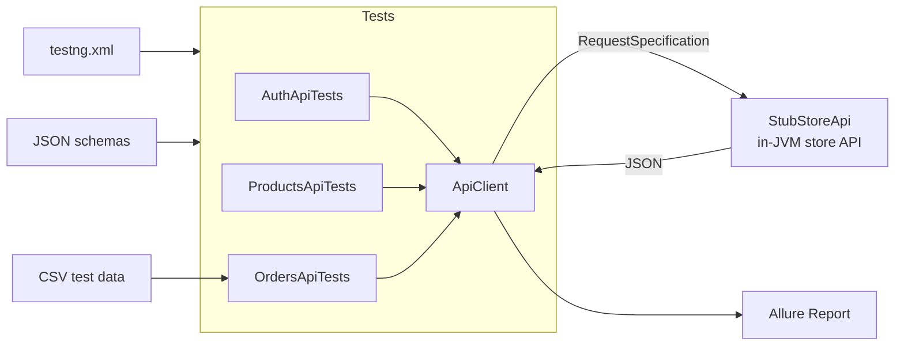

# E-commerce API Automation Framework

[](https://github.com/PrathyushaReddyVeerarapu/ecommerce-api-automation-framework/actions/workflows/api-tests.yml)


A production-style API test automation framework for a demo e-commerce store —
built the way I'd build it at work, not the way tutorials build it.

**What's inside:** token auth, product catalog, order placement with real
inventory validation, JSON contract schemas, data-driven negative tests, Allure
reporting, and a CI pipeline. The entire store API is stubbed in-JVM, so the
suite is deterministic and runs anywhere — laptop, CI, airplane mode.

## Architecture



## Quickstart

Requirements: Java 17+, Maven 3.8+.

```bash
git clone https://github.com/PrathyushaReddyVeerarapu/ecommerce-api-automation-framework.git
cd ecommerce-api-automation-framework

# run the full suite (spins up the stub store API automatically)
mvn test

# run against a real environment instead of the stub
mvn test -Dapi.baseUri=https://store-api.qa.example.com -Dapi.basePath=/api/v1
```

Generate the Allure report (needs the [Allure CLI](https://allure.qameta.io/)):

```bash
allure serve target/allure-results
```

## What's covered

| Area | Tests | Highlights |
|---|---|---|
| Auth | 5 | Valid login, wrong password, unknown user, missing/forged token |
| Products | 5 | Catalog + contract schema, 3× data-driven product lookup, 404 code |
| Orders | 9 | Stock actually decrements, 6 CSV-driven negative cases, schema checks, history |

**19 tests, 0 flakes by design** — no sleeps, and no test assumes seeded
inventory values (the order test reads stock before/after placing the order, so
execution order can't break it). The stub API is synchronous and deterministic.

## Project structure

```
├── src/main/java/com/prathyusha/ecommerceapi
│   ├── client/ApiClient.java        # every RequestSpecification is built here — no copy-paste given() blocks
│   ├── config/FrameworkConfig.java  # env overrides via -Dapi.baseUri=... (no code changes)
│   ├── model/                       # Jackson POJOs: Product, OrderRequest, ...
│   └── utils/StubStoreApi.java       # in-JVM stub store API (auth, catalog, inventory, orders)
├── src/test/java/.../tests
│   ├── BaseApiTest.java             # boots stub @BeforeSuite, logs in @BeforeClass
│   ├── AuthApiTests.java
│   ├── ProductsApiTests.java
│   └── OrdersApiTests.java
├── src/test/resources
│   ├── schemas/                     # JSON contract schemas (auth, product, order, error)
│   ├── testdata/negative-orders.csv # add cases without touching Java
│   └── testng.xml
└── .github/workflows/api-tests.yml  # CI: JDK 17 → mvn test → upload Allure results
```

## Design decisions (what I learned building this)

**1. Stub the API, don't mock the tests.**
Hitting a live demo API means your suite breaks when someone else's server has a
bad day. The in-JVM stub encodes real domain rules — insufficient stock is
*computed* from inventory, not canned — so tests verify behaviour.

**2. One place builds every request.**
`ApiClient` owns base URIs, headers, logging and the Allure filter. Test classes
contain assertions and scenarios, never boilerplate.

**3. Assert behaviour, not fixtures.**
The order test reads stock before and after instead of asserting a hardcoded
number. Tests stay green regardless of execution order.

**4. Error codes are a contract too.**
Every negative test asserts the machine-readable `code` (`INSUFFICIENT_STOCK`,
`PRODUCT_NOT_FOUND`, …), not just the HTTP status. UIs and downstream services
key off these codes — they're part of the API.

**5. Data belongs in files, not annotations.**
Negative order cases live in a CSV. Adding a case is a one-line diff that
anyone on the team can review.

## Tech stack

Java 17 · Maven · REST Assured 5 · TestNG 7 · Allure · Jackson · JSON Schema
validation · GitHub Actions

## Roadmap

- [ ] Parallel execution with isolated inventory state per thread
- [ ] Contract tests against an OpenAPI spec
- [ ] Performance smoke: order latency percentiles via Gatling
- [ ] Docker image of the stub API for contract-testing consumers

## License

MIT — use it, fork it, put it in your interviews.
